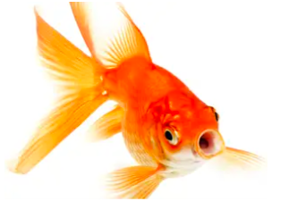

```{r setup, include=FALSE}
knitr::opts_chunk$set(echo = FALSE)
```

# Introduction 


## About Me | Personal 

  - Born in Oregon, USA
  - Favorite food: Pad se ew 
  - Favorite animal: Bowhead whale 

## About Me | Academic  

  - University of Washington 
  - Major: Marine Biology
  - Expected Graduation: June 2021 
  
## About Me | Things I've misesed suring the pandemic 

  1) Going to the gym
  2) Traveling on a plane 
  3) Visiting my grandma 
  
# Data Science 


## Course Topics | Three things I enjoyed learning 

  1) How to better utilize GitHub: forking, requests, issues 
  2) Creating a Database using PostgresSQL
  3) Publishing a report using R Markdown 
  
## Course Topics | Three things I'd like to learn more about 

  1) PostgresSQL, more practice!
  2) How to revert a file in Git 
  3) Unit tests in R packages 
  
---


Thank you Mark.
This was a fun and informative class. 


